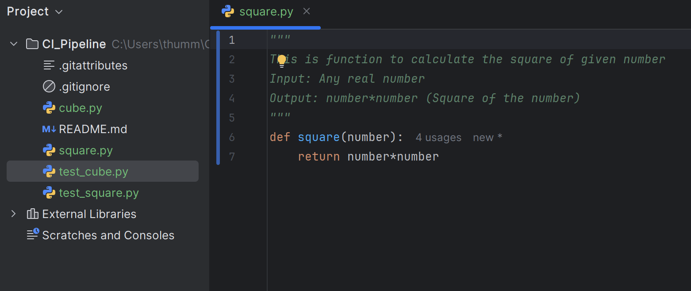
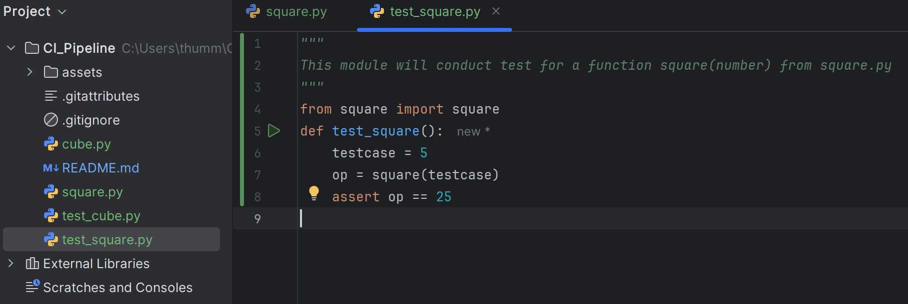
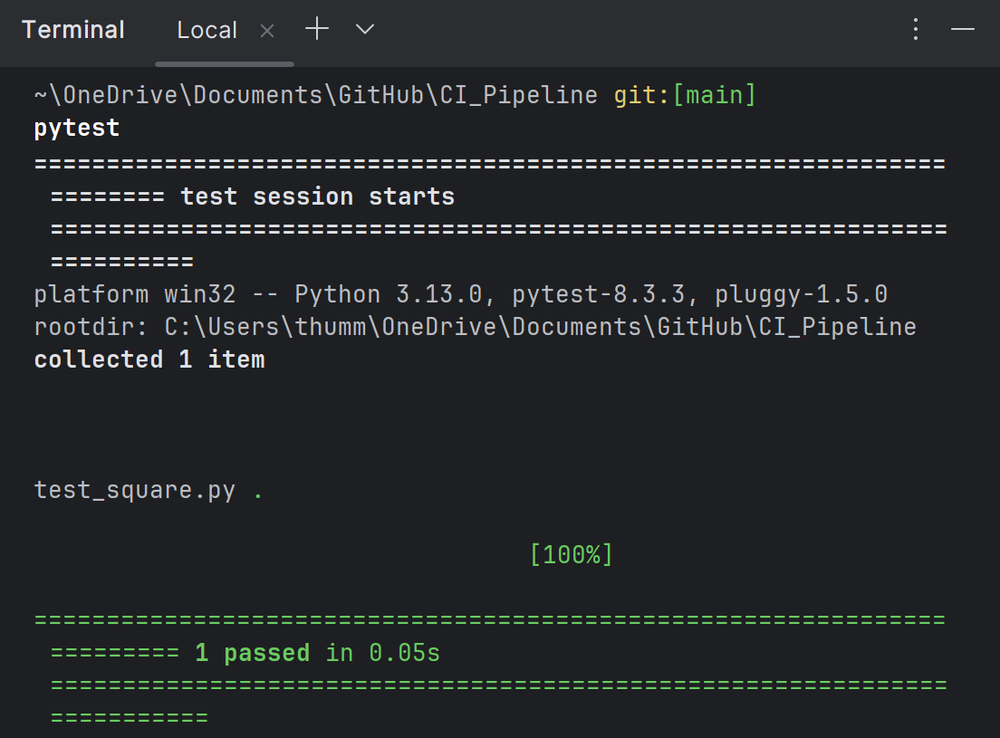
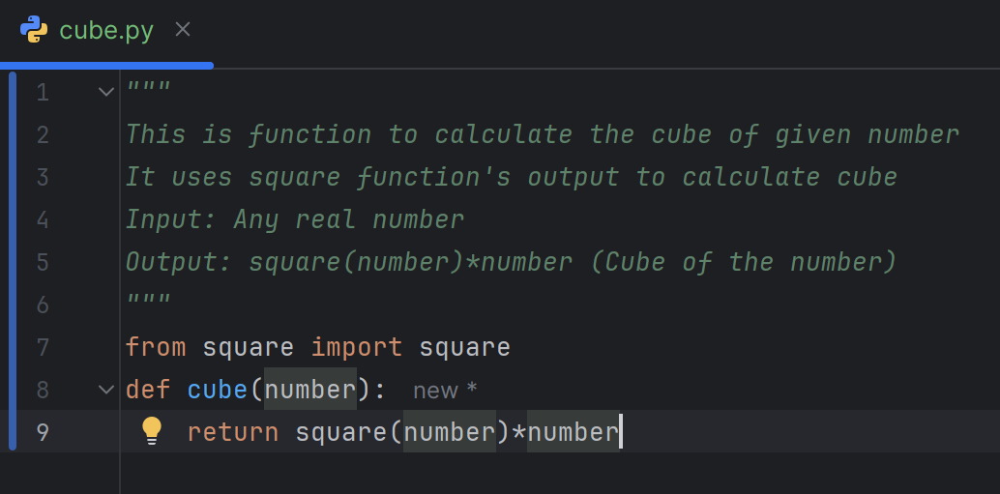
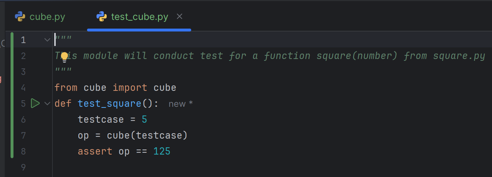
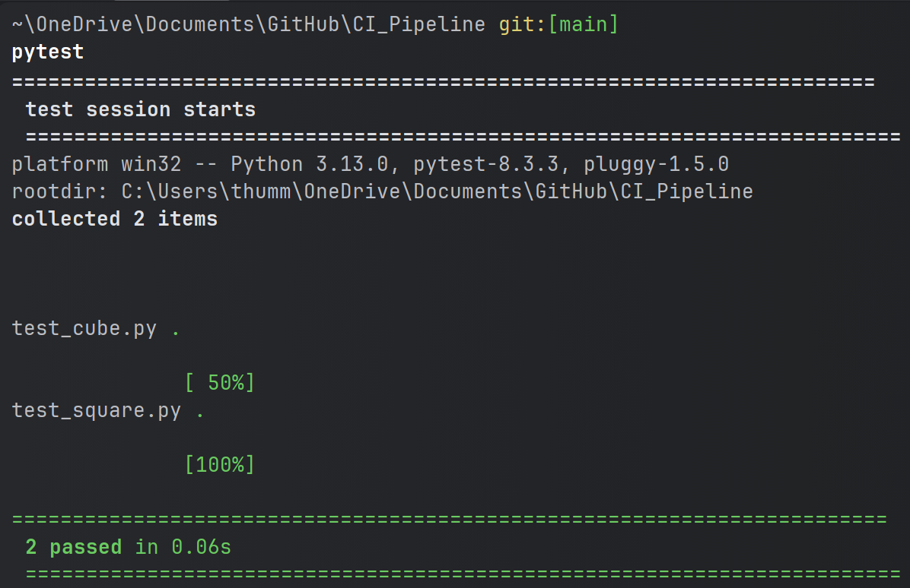
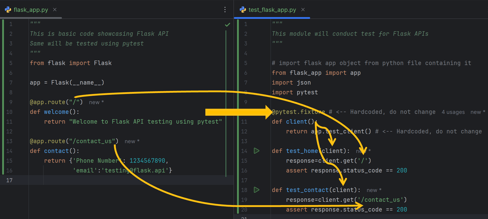
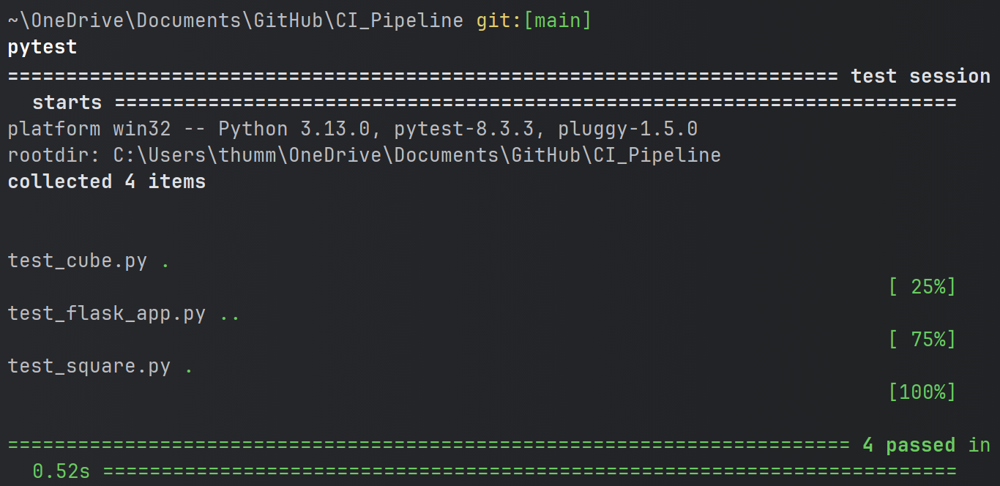
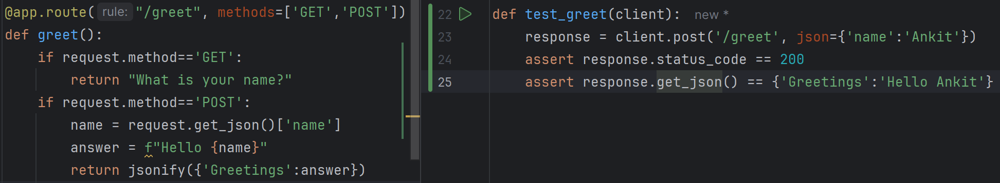

# CI_Pipeline

Continuous Integration Pipeline

# How to write Unit tests

Unit tests are test which verifies individul function output with desired output

1. Create Python file and write desired code
   
2. Create another python file to write function to test methods in existing python file
   
3. Go to terminal, execute `pytest` to conduct a test and verify result
   
4. Repeat step-1 to 3 for all other python files in project.

# Testing Flask Application with `fixture`

1. Create python file and write a code for Flask API
2. Create another python file to write function to test Flask APIs
   
3. Run `pytest` from terminal to check test result summary
4. Test case for POST requests
